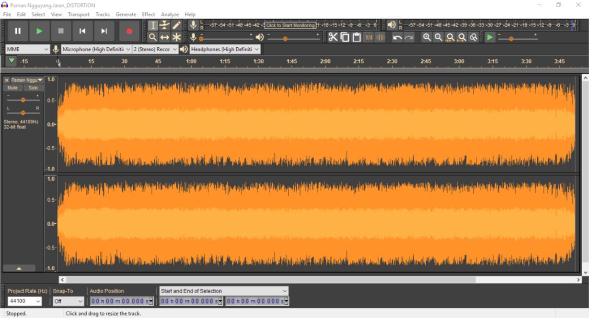
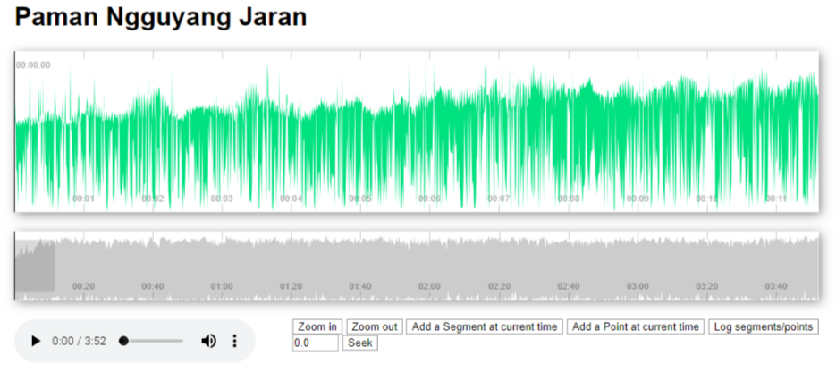

# :headphones: Man Paman Sing Ngguyang Jaran :racehorse:
Lagu ini bisa bermakna sangat banyak salah satunya adalah suatu peringatan dimana kehilangan popok bayi merupakan pertanda bahwa hilangnya penutup (popok) itu merupakan simbol dari hilangnya suatu "kehormatan/harga diri" yang bahkan sudah terjadi sejak bayi. 

Sumber audio sebenarnya sangat penuh noise, glitch dsb dan dengan memakai Audacity (yang dipakai disini versi 2.2.2) mungkin repositori ini bisa sebagai pembelajaran untuk editing audio :smile:




## :musical_note: Lirik

```
Man Paman Sing Ngguyang Jaran
Nopo Wau Wonten Popok Beruk Keri
Popoke Limaran Nggih Sulaman Beruke Cengkir Gading Kir Ukiran?

[waduh nduk ora eruh aku, neng coba takono karo paman sing ngguyang kebo, coba...]

Man Paman Sing Ngguyang Kebo
Nopo Wau Wonten Popok Beruk Keri
Popoke Limaran Nggih Sulaman Beruke Cengkir Gading Kir Ukiran?

[waduh waduh aku ra ngerti nduk, coba takono karo paman sing ngguyang sapi iku...]

Man Paman Sing Ngguyang Sapi
Nopo Wau Wonten Popok Beruk Keri
Popoke Limaran Nggih Sulaman Beruke Cengkir Gading Kir Ukiran?

[waduh ra ngerti nduk, tenan ra ngerti coba takono karo nini nini sing mususi kae..]

Ni Nini Sing Mususi
Nopo Wau Wonten Popok Beruk Keri
Popoke Limaran Nggih Sulaman Beruke Cengkir Gading Kir Ukiran?

[Ohhh ono nduk..ono, iki lho...neng syarate opo kowe arep dipek anak karo buto?]
```

## :radio:
Kalau memakai browser modern (kayak chrome terbaru) anda bisa mencoba player untuk lagu satu ini.



[> saya lebih suka pake :headphones: bruh!](https://junwatu.github.io/paman-ngguyang-jaran/)

## Disclaimer

Repositori ini bertujuan hanya untuk edukasi dan mendekatkan diri dengan budaya jawa khususnya. 

> Source audio diambil dari Sinau bareng Cak Nun dan Kiai Kanjeng di Ringin Harjo, Bantul 2019.

Hak Cipta Lagu dsb ada Pada Kiai Kanjeng dan Cak Nun.


---
Equan Pr.

2019
